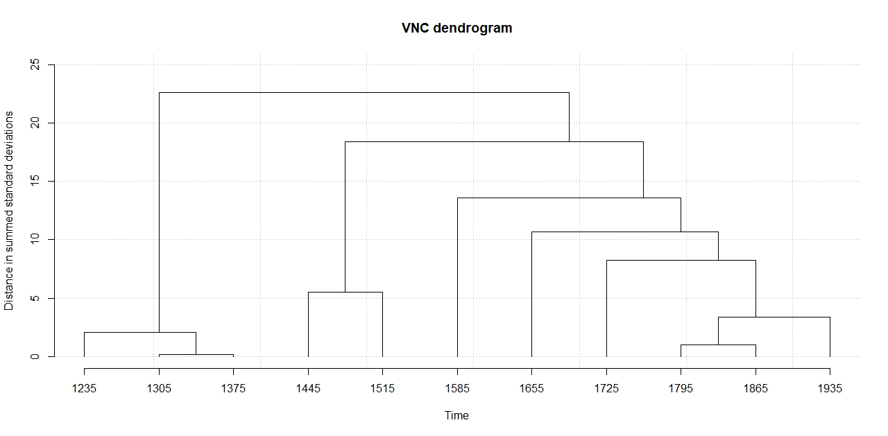
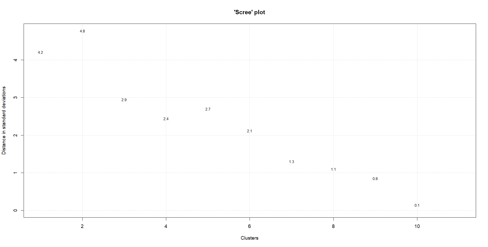
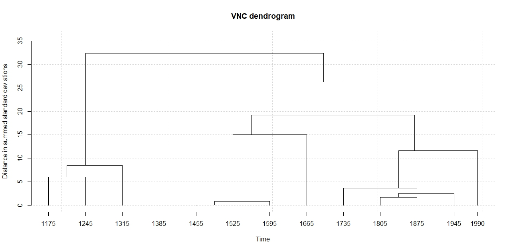
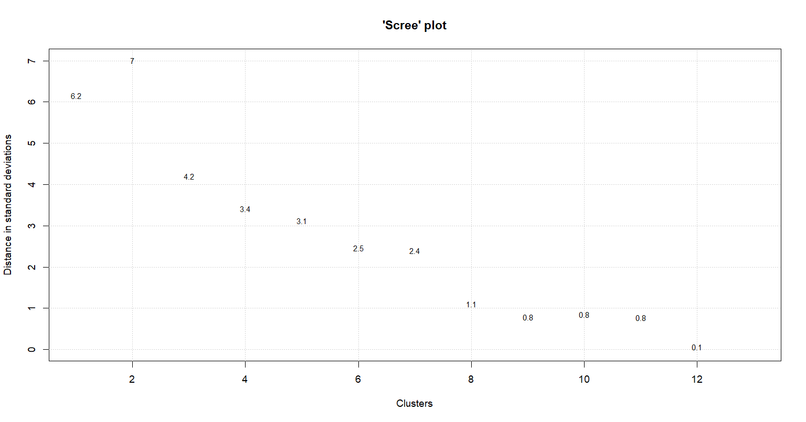

```{r setup, include=FALSE, warning=FALSE, message = F}

knitr::opts_chunk$set(include=TRUE, warning=FALSE, message = F)

```


```{r}
library(tidyverse)
library(lme4)
library(kableExtra)
library(DT)
library(data.table)
library(wesanderson)
library(here)

setwd(here::here())
getwd()

  romall<-readxl::read_excel("romance_all_bruciare_clean_new_vnc_final.xlsx")
  
  nrow(romall)
  
   nc<-readxl::read_excel("romance_noncaus_feb24_filteredverbs_final.xlsx")
  
  nrow(nc)
  
  
any(duplicated(romall$id))  # TRUE if duplicates exist
any(duplicated(nc$id))

  
  
  
  romall %>%
  count(id) %>%
  filter(n > 1)
  
  romall %>%
  count(id) %>%
  filter(n > 1)

  
  romall %>%
  filter(duplicated(id) | duplicated(id, fromLast = TRUE)) %>%
  arrange(id)
  
  nc %>%
  filter(duplicated(id) | duplicated(id, fromLast = TRUE)) %>%
  arrange(id)

  
  make_ids_unique <- function(df) {
  df %>%
    group_by(id) %>%
    mutate(id = if (n() > 1) paste0(id, "_", row_number()) else id) %>%
    ungroup()
}

# Apply to both datasets
romall <- make_ids_unique(romall)
nc <- make_ids_unique(nc)

  

  

```


# Calculating the causalness degree over time

## Overall purpose

We would like to include a new predictor in our dataset, namely the **proportions of causal transitive uses (vs. non causal uses) of the verbs by time**, which we define as `causalness degree`. In order to do so we need to come up with a periodisation for our data (spanning between 1140 and 2001), which allows to calculate the relative frequency of causal uses by time. To reach a periodisation, a visual survey of the data can be instructive, it might pose the problem of the analyst’s bias, as “different researchers may arrive at different groupings even for the same data set” (Gries & Hilpert 2008:2).

## Variability neighbour clustering (VNC)

Gries & Hilpert (2008) propose a more accurate method to come up with meaningful periodisation for a given dataset: Variability-based Neighbor Clustering (VNC). It is similar to hierarchical cluster analysis (HCA), i.e. a method that displays a hierarchy of clusters, typically in the form of dendrograms with branches and leaves. Differently from HCA, VNC does justice to the chronological linearity of linguistic developments by not separating adjacent periods, and shows significant differences between periods based on the standard deviation, which is taken as similarity measure and averaging as amalgamation rule.

The analyst needs to input the proportions of a given variant (in our case, causal uses) for periods, ideally decades. The choice of the periods size is somewhat arbitrary, but making different attempts helps to find the right balance between data sparsity and significance of the VNC results. Because at various points in the diachrony of our dataset data are scarce (see Histogram), we started with periods of 20 years and ended up with periods of 70 years. The VNC periodisation based on periods of 70 years is the one with the best results in statistical terms, as the standard deviation measure for different periods are large enough to show significant differences. Hereby we show the procedure.

```{r}
ggplot(romall, aes(x=year, fill=semantics)) +
  geom_histogram(alpha = 0.5, position="stack") +
  facet_wrap(~stringr::str_to_title(language))+
  scale_fill_manual(labels=c("Causal", "Noncausal"), values= (c("#fc8961", "#b73779")))+ #wes_palette(n=2, name="GrandBudapest1"))+
  theme_minimal()
```

### Establish the 70-years periodisation

* Step 1: Split the Italian and Spanish dataset
* Step 2: Create a new variable with the years groups in 70-years periods. Periods are indicated with the central years in the 70 years span, i.e. 1175 stands for the period between 1140 and 1210. 
* Step 3: Create a table with proportions of causal and noncausal uses by 70-years periods


```{r}

# Step 1
esp <- filter(romall, language=="spanish")
ita <- filter(romall, language=="italian")


# Step 2
esp<-esp %>% 
  mutate(
    period70_es=case_when(
      year<1210 ~ "1175",
      year<1280 ~ "1245",
      year<1350 ~ "1315", 
      year<1420 ~ "1385", 
      year<1490 ~ "1455",
      year<1560 ~ "1525",
      year<1630 ~ "1595",
      year<1700 ~ "1665",
      year<1770 ~ "1735",
      year<1840 ~ "1805",
      year<1910 ~ "1875",
      year<1980 ~ "1945",
      year<=2001 ~ "1990"
    )
  )
which(is.na(esp$period70))

ita<-ita %>% 
  mutate(
    period70_ita=case_when(
      year<1270 ~ "1235",
      year<1340 ~ "1305",
      year<1410 ~ "1375", 
      year<1480 ~ "1445", 
      year<1550 ~ "1515",
      year<1620 ~ "1585",
      year<1690 ~ "1655",
      year<1760 ~ "1725",
      year<1830 ~ "1795",
      year<1900 ~ "1865",
      year<1970 ~ "1935"
    )
  )
which(is.na(ita$period70))

# Step 3

es_perctable70<-table(esp$period70_es,esp$semantics)
es_perctable70<-prop.table(es_perctable70,1)*100
es_perctable70<-as.data.frame(es_perctable70)

ita_perctable70<-table(ita$period70_ita,ita$semantics)
ita_perctable70<-prop.table(ita_perctable70,1)*100 
ita_perctable70<-as.data.frame(ita_perctable70)

```

The range of years in the italian dataset is `r range(ita$year)` and for Spanish `r range(esp$year)`.

### Apply the Variability neighbour clustering (VNC)

* Step 1: read the VNC instructions and download the VNC file at this [link]((https://global.oup.com/us/companion.websites/fdscontent/uscompanion/us/static/companion.websites/nevalainen/Gries-Hilpert_web_final/vnc.individual.html))

* Step 2: Rename the columns following the instructions from the website


* Step 3: visualise input table for VNC and print it as a txt file

```{r}

# Step 2

es_perctable70<-filter(es_perctable70, Var2== "caus") %>% 
  rename(year = Var1,input = Freq) %>% 
  select(year, input) 

ita_perctable70<-filter(ita_perctable70, Var2== "caus") %>% 
  rename(year = Var1,input = Freq) %>% 
  select(year, input) 

  #round up the proportions  
table_ita<-ita_perctable70
table_ita$input<-round(table_ita$input, digits = 1) 

table_es<-es_perctable70
table_es$input<-round(table_es$input, digits = 1) 

#Step 3

table_ita %>% 
  kbl(booktabs = TRUE, col.names = c("% Causal uses - Italian", paste0("70 years periods", footnote_marker_symbol(1))), escape = F, caption = "Input table for the VNC") %>% 
  kable_styling()  %>% 
  footnote(symbol = "Periods are indicated with the central years in the 70 years span, i.e. 1175 stands for the period between 1140 and 1210")

table_es %>% 
  kbl(booktabs = TRUE, col.names = c("% Causal uses - Spanish", paste0("70 years periods", footnote_marker_symbol(1))), escape = F, caption = "Input table for the VNC") %>% 
  kable_styling()  %>% 
  footnote(symbol = "Periods are indicated with the central years in the 70 years span, i.e. 1175 stands for the period between 1140 and 1210")


setcolorder (table_es, c("input", "year"))
write.table(table_es, file = "esp_vnc_caus_70y_p.txt", sep = "\t", quote = FALSE, row.names = F)

setcolorder (table_ita, c("input", "year"))
write.table(table_ita, file = "ita_vnc_caus_70y_p.txt", sep = "\t", quote = FALSE, row.names = F)

```

* Step 4:  enter vnc.individual(file.choose()) and, when prompted to choose/enter a file name, choose/enter the path to the file with the data to be analyzed on the harddrive (e.g. newdata.txt).

```{r, eval=FALSE, include=TRUE}

#do not run

load("vnc.individual.RData")

vtxtnc.individual("esp_vnc_caus_70y_p.txt")

load("VNC/vnc.individual.RData")

vnc.individual("VNC/ita_vnc_caus_70y.txt")

```

Running the previous script will generate two graphs in separate windows: a dendrogram and a screeplot of the type shown below:

The dendogram specifies how periods are clustered (the periods that are the most similar are amalgamated first). The analyst should asses how many development stages are considered relevant to the diachronic study. The screeplot produced by the VNC function allows the linguist to decide by comparing the distances between successive mergers (measured with standard deviations). Essentially, one should observe the slope from left to right, and take the number of clusters with the largest differences, until the slope is leveled off (i.e., until the difference between clusters is marginal). In this case 4 or 6 clusters seems adequate. Given that we want to minimise data sparsity, we make the most parsimonious choice and select the first 4 clusters.









We identify a minimal number of relevant clusters, to avoid data sparsity. It seems reasonable to choose a 4 cluster classification for both languages.

From the interpretation of the VNC results we end up with 4 significant periods for the development of the causal vs. non causal alternation in Spanish, dividing our dataset in the following periods: 1140-1209,1210-1279, 1280-1559, 1560-2001. Data are distributed across periods as summarised below. In Spanish causal uses are consistently higher than noncausal ones, but always below 60% except in the second period where they reach 73%.

```{r}

esp<-esp %>% 
  mutate(
    es_vnc70_apr25=case_when(
      year<1350 ~ "1140-1349",
      year<1420 ~ "1350-1419",
      year<1700 ~ "1420-1699",
      year<2002 ~ "1700-2001"
    )
  )

summary_es<-esp %>%
  group_by (es_vnc70_apr25, semantics) %>%
  summarise (n=n()) %>%
  mutate(rel.freq = paste0(round(100 * n/sum(n), 0), "%"))

summary_es %>%  kbl(booktabs = TRUE, col.names = c("VNC periods", "Semantics", "Count", "Relative Frequency (%)"), caption = "Spanish - Summary of the verb semantics by VNC periods") %>%
   collapse_rows(column = 1) %>% 
  kable_styling() 

```

For Italian, the relevant 4 periods indicated by the dendogram are "1200-1409", 1410-1549, 1550-1619 and 1620-1968, Data are distributed across periods as summarised below. In Italian, causal uses are consistently more frequent than non causal ones, always higher than 60%. Their relative frequency is at the highest in the second period, when they reach 73%, like in Spanish. However, the second VNC period in Italian is about a century later than in Spanish.


```{r}

ita<-ita %>% 
  mutate(
    ita_vnc70_apr25=case_when(
      year<1410 ~ "1200-1409",
      year<1550 ~ "1410-1549",
      year<1620 ~ "1550-1619",
      year<=1970 ~ "1620-1968"
    )
  )

summary_ita<-ita %>%
  group_by (ita_vnc70_apr25, semantics) %>%
  summarise (n=n()) %>%
  mutate(rel.freq = paste0(round(100 * n/sum(n), 0), "%"))

summary_ita %>%  kbl(booktabs = TRUE, col.names = c("VNC periods", "Semantics", "Count", "Relative Frequency (%)"), caption = "Italian - Summary of the verb semantics by VNC periods") %>%
   collapse_rows(column = 1) %>% 
  kable_styling() 

```

### Calculate the `Causalness Degree` 

Once we found out the significant periods for the causal/non causal alternation, we calculate the share of causal uses by verb lemma and by period. Namely, every verb lemma in each of the four periods is assigned a number between 0 and 1, indicating the proportion (%) of causal uses *vs.* non causal uses. The table below summarises the distribution of causal uses by lemma and period (variable *caus_use*).

Italian:

```{r}
caus_use_ita<-ita %>%
  group_by (ita_vnc70_apr25, lemma, semantics) %>%
  summarise (n=n()) %>%
  mutate(caus_use_ita_apr25 = n/sum(n))


caus_use_ita<-caus_use_ita %>% filter(semantics=="caus") %>% ungroup() %>% select (-semantics)

caus_use_ita %>% DT::datatable(rownames=F, filter="top")

```

Spanish:

```{r}
caus_use_es <-esp %>%
  group_by (es_vnc70_apr25, lemma, semantics) %>%
  summarise (n=n()) %>%
  mutate(caus_use_es_apr25 = n/sum(n))


caus_use_es<-caus_use_es %>% filter(semantics=="caus") %>% ungroup() %>% select (-semantics)

caus_use_es %>% DT::datatable(rownames=F, filter="top")

```


And finally rejoin the individual languages new information (`period70, vnc and causalness degree`) to the main dataset: 

```{r}

library(dplyr)

# 1. Join caus_use_ita to ita by vnc and lemma
ita <- ita %>%
  left_join(caus_use_ita, by = c("ita_vnc70_apr25" = "ita_vnc70_apr25", "lemma" = "lemma"))

# 2. Join caus_use_es to esp by vnc and lemma
esp <- esp %>%
  left_join(caus_use_es, by = c("es_vnc70_apr25" = "es_vnc70_apr25", "lemma" = "lemma"))

# 3. Rename columns to match target names before merging into romall
ita <- ita %>%
  rename(
    vnc_period_apr25 = ita_vnc70_apr25,
    causalness_degree_apr25 = caus_use_ita_apr25
  )

esp <- esp %>%
  rename(
    vnc_period_apr25 = es_vnc70_apr25,
    causalness_degree_apr25 = caus_use_es_apr25
  )

# 4. Bind the two enriched subsets together
combined <- bind_rows(ita, esp)

# 5. Join back to romall by id and lemma
romall <- romall %>%
  left_join(combined %>% select(id, lemma, vnc_period_apr25, causalness_degree_apr25),
            by = c("id", "lemma"))


nc <- nc %>%
  left_join(combined %>% select(id, lemma, vnc_period_apr25, causalness_degree_apr25),
            by = c("id", "lemma"))

```


```{r}

#openxlsx::write.xlsx(romall, "romall_new_VNC.xlsx")
#openxlsx::write.xlsx(nc, "noncaus_new_VNC.xlsx")


```


# Frequency effects of causal degree on anticausative marking over time


```{r}
# only non causal, verbs with categorical selection removed

ita_nc<-nc %>% filter(language=="italian")
es_nc<-nc %>% filter(language=="spanish")


ita_nc<-ita_nc %>% select(id, coding, meaning, lemma, vnc_period_apr25, causalness_degree_apr25)

ita_nc<-ita_nc %>% rename(period=vnc_period_apr25, causalness_degree=causalness_degree_apr25)

es_nc<-es_nc %>% select(id, coding, meaning, lemma, vnc_period_apr25, causalness_degree_apr25)

es_nc<-es_nc %>% rename(period=vnc_period_apr25, causalness_degree=causalness_degree_apr25)

```

## Italian data: prepare for Beta Regression

Subset the Italian data to obtain unique combinations of lemma and period. 

 * Step 1: Aggregate data to calculate the proportion of anticausative codings
 
```{r}

ita_agg <- ita_nc %>%
  group_by(lemma, period) %>%
  summarise(
    anticausative_count = sum(coding == "antic"),
    total_count = n(),
    proportion_anticausative = anticausative_count / total_count,
    causalness_degree = first(causalness_degree),
      ) %>%
  ungroup()
```

 * Step 2: Create a lagged causalness_degree variable

```{r}
ita_agg <- ita_agg %>%
  arrange(lemma, period) %>%
  group_by(lemma) %>%
  mutate(causalness_lagged = lag(causalness_degree)) %>%
  ungroup() %>%
  # Remove rows without previous causalness_degree (period 1)
  filter(!is.na(causalness_lagged))
```

 * Step 3: Adjust proportions slightly to avoid exact 0 and 1

```{r}
ita_agg <- ita_agg %>%
  mutate(proportion_adj = (proportion_anticausative * (total_count - 1) + 0.5) / total_count)

ita_agg<-ita_agg %>%
  filter(!is.na(proportion_adj), !is.na(causalness_lagged))

ita_agg <- ita_agg %>%
  mutate(across(5:8, ~ round(.x, 2))) 

```


## Spanish data: prepare for Beta Regression

Subset the Spanish data to obtain unique combinations of lemma and period. 

* Step 1: Aggregate data to calculate the proportion of anticausative codings:


```{r}
es_agg <- es_nc %>%
  group_by(lemma, period) %>%
  summarise(
    anticausative_count = sum(coding == "antic"),
    total_count = n(),
    proportion_anticausative = anticausative_count / total_count,
    causalness_degree = first(causalness_degree),
    ) %>%
  ungroup()

```

* Step 2: Create a lagged causalness_degree variable:

```{r}
es_agg <- es_agg %>%
  arrange(lemma, period) %>%
  group_by(lemma) %>%
  mutate(causalness_lagged = lag(causalness_degree)) %>%
  ungroup() %>%
  # Remove rows without previous causalness_degree (period 1)
  filter(!is.na(causalness_lagged)) 
```

* Step 3:Adjust proportions slightly to avoid exact 0 and 1


```{r }
es_agg <- es_agg %>%
  mutate(proportion_adj = (proportion_anticausative * (total_count - 1) + 0.5) / total_count)

es_agg<-es_agg %>%
  filter(!is.na(proportion_adj), !is.na(causalness_lagged))

es_agg <- es_agg %>%
  mutate(across(5:8, ~ round(.x, 2))) 

```


## Fit the Beta Regression model

* Step 1: join the Italian and Spanish sub-dataset; convert factors to ordered factors and set contrasts to "contr.treatment" (Soskuthy, 2017, p.24)


```{r}

# Add a column to each dataset to distinguish them
italian <- ita_agg %>%
  mutate(language = "Italian")

spanish <- es_agg %>%
  mutate(language = "Spanish")

# Combine the datasets using bind_rows()
join <- bind_rows(italian, spanish)

# View the combined dataset
head(join)

# prepare factors variables

join$language<-as.factor(join$language)

join$lemma<-as.factor(join$lemma)
join$period_cat<-as.factor(join$period)
join$period<-as.factor(join$period)


# join <- join %>%
#   mutate(period_ord = ordered(period)) %>%
#   mutate(lemma = ordered(lemma)) %>% 
#   mutate(language = ordered(language)) 
# 
# contrasts(join$period_ord) <- "contr.treatment"
# contrasts(join$lemma) <- "contr.treatment"
# contrasts(join$language) <- "contr.treatment"

join <- join %>%
  mutate(period_ord = ordered(period))

join$period <- as.numeric(join$period_cat)
join$period_cat

correspondence_check <- data.frame(
  period_cat = join$period_cat,
  period_num = join$period
)

# View the correspondence check
print(correspondence_check)

```

* Step 2: Fit a beta regression model with `mgvc::gam`: *model1* is the maximal model;


```{r}
# Load required libraries
library(mgcv)
library(report)
library(itsadug)

model1 <- gam(
  proportion_anticausative ~ 
    language + #you must include interaction terms as main effects too!
    s(causalness_lagged, k=20)+
    s(period, k=5)+
    s(causalness_lagged, by = language, k = 20, bs = "cs", m = 1) + 
    s(period, by = language, k = 5, bs = "cs", m= 1),   
  family = betar(link = "logit"),                 
  data = join
)

# Summarize the model
summary(model1)

gam.check(model1)


```

* Step 3: in *model2* and *model3* we remove the interaction terms from *model1*, and use anova to assess whether this significantly affect the model fit (backward model selection). In both cases, removing the interaction term `language` significantly impact the goodness-of-fit (ANOVA is significant). Since it is not possible to remove the interactions, we also do not remove the simple terms. This leads to the conclusion that *model1* is the best fitted model.

```{r}

#remove s(period, by = language, k = 5, bs = "cs", m= 1),   


model2 <- gam(
  proportion_anticausative ~ 
    language + #you must include interaction terms as main effects too!
    s(causalness_lagged, k=20)+
    s(period, k=5)+
    s(causalness_lagged, by = language, k = 20, bs = "cs", m = 1),
  family = betar(link = "logit"),                 
  data = join
)

anova.gam(model1, model2, test = "Chisq") 

compareML(model1, model2)

AIC(model1, model2)

summary(model2)

model3 <- gam(
  proportion_anticausative ~ 
    language + #you must include interaction terms as main effects too!
    s(causalness_lagged, k=20)+
    #s(period, k=5)+
    s(causalness_lagged, by = language, k = 20, bs = "cs", m = 1),
  family = betar(link = "logit"),                 
  data = join
)

summary(model3)

anova.gam(model3, model2, test = "Chisq") 

compareML(model3, model2)

AIC(model3, model2)

gam.check(model3)

 gratia::draw(model3)


model4 <- gam(
  proportion_anticausative ~ 
    language + #you must include interaction terms as main effects too!
    #s(causalness_lagged, k=20)+
    #s(period, k=5)+
    s(causalness_lagged, by = language, k = 20, bs = "cs", m = 1),
  family = betar(link = "logit"),                 
  data = join
)

summary(model4)

anova.gam(model3, model4, test = "Chisq") 

compareML(model3, model4)

AIC(model3, model4)

gam.check(model4)


gratia::draw(model4)


```

*Step 4: Print the results of the model

```{r}
results<-report::report_table(model4)
report::display(results)

```


## Visualise the results

Visualisation of the effect of `causalness_lagged` and `period` of *model1* (now renamed *model*).

```{r}
library(mgcv)
model<-model4

# Incorporate predictions from beta regression to the original dataset
fit <- join %>%
  mutate(fit = predict(model4, newdata = join, type = "response"))

ggplot(fit, aes(x = causalness_lagged, y = proportion_anticausative, color = causalness_lagged)) +
  geom_point( alpha = 0.7, color= "#fc8961") +  
  geom_smooth(method = "gam", se = F, aes(group = language), color= "#fc8961", linewidth = 1.2) +  
    facet_wrap(~ language) +  
  labs(
    title = "model4",
    x = "Lagged Causalness Degree",
    y = "Proportion of Anticausative",
    color = "Lagged Causalness Degree"
  ) +
  ylim(0,1)+
  theme_minimal() +
  theme(legend.position = "bottom")


fit2 <- join %>%
  mutate(fit = predict(model3, newdata = join, type = "response"))

ggplot(fit2, aes(x = causalness_lagged, y = proportion_anticausative, color = causalness_lagged)) +
  geom_point( alpha = 0.7, color= "#fc8961") +  
  geom_smooth(method = "gam", se = F, aes(group = language), color= "#fc8961", linewidth = 1.2) +  
    facet_wrap(~ language) +  
  labs(
    title = "model3",
    x = "Lagged Causalness Degree",
    y = "Proportion of Anticausative",
    color = "Lagged Causalness Degree"
  ) +
  ylim(0,1)+
  theme_minimal() +
  theme(legend.position = "bottom")


```
 


